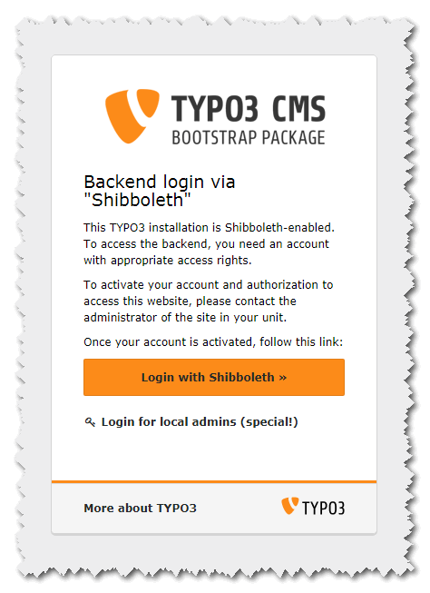
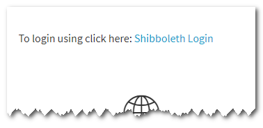

.. ==================================================
.. FOR YOUR INFORMATION
.. --------------------------------------------------
.. -*- coding: utf-8 -*- with BOM.

.. include:: ../Includes.txt

.. _introduction:

Introduction
============

.. _screenshots:

Screenshots
-----------

.. image:: ../Imagedir/be_form_typo3_8.png

.. _what-it-does:

What does it do?
----------------

This extension is an authentication extension, which allows to use Shibboleth as login system for FE
as well as BE authentication. It requires the mod_shib Apache module installed and configured on the
web server. It offers versatile options to handle users being authenticated by Shibboleth.

“The Shibboleth® System is a standards based, open source software package for web single sign-on
across or within organizational boundaries. It allows sites to make informed authorization decisions
for individual access of protected online resources in a privacy-preserving manner.” (Cited from
https://www.internet2.edu/products-services/trust-identity-middleware/shibboleth/).

.. _getting-started:

Getting started
---------------

It must be said that setting up Shibboleth is a complex task. This is for two reasons.

* A number of componentes and systems must be configured to work together.
* Every organization has it's own demands and requirements in how to use Shibboleth.

    **I know, you are short of time.** If you really want to skip from here on, please read at least the :ref:`configuration-checklists`. It will help you save time and
    avoid serious errors in the configuration. **Be aware that defining a wrong login process is almost always a security issue!**

    **It is your responsiblity to test your configuration to make really sure, no one can login, who should not be allowed to do so!**

To get the installation done in a most straight forward way, I recommend to follow these steps:
^^^^^^^^^^^^^^^^^^^^^^^^^^^^^^^^^^^^^^^^^^^^^^^^^^^^^^^^^^^^^^^^^^^^^^^^^^^^^^^^^^^^^^^^^^^^^^^

* Make sure to fulfill the :ref:`administration-prerequisites`.
* You avoid a lot of troubleshooting, if you check your Shibboleth installation by the method described in :ref:`configuration-checking-the-installation`.
* As described there, take a copy of the contents of the $_SERVER variable. You will use this later, when defining your login conditions and parameters.
* Install and activate this extension (:ref:`administration-installation`)
* Make sure to create your own "mapping configuration" file, e.g. by taking a copy of the sample file. **Never use the sample file directly!** (:ref:`configuration-configuration-options-mapping-configuration-file`)
* Change the extension configuration where needed. You will have to at least change the path to the "mapping configuration" file and to switch on FE and/or BE authentication. For FE you additionally have to specify the user storage folder by it's PID. (see :ref:`configuration-configuration-options-tables`)
* Be sure to thoroughly think about the correct conditions for letting users in! (see :ref:`defining-requirements`)
* Then edit the "configuration mappings" file accrodingly. (see :ref:`configuration-configuration-options-mapping-configuration-file`)
* This is also the right time to go through the :ref:`configuration-checklists`
* For the frontend, insert the frontend plugin whereever you want it to have.
* Have a first try! If it fails, refer to :ref:`debugging`.
* Finally, test the result thoroughly! Use all types of users that shall be allowed to log in as well as those that must not be allowed to login!